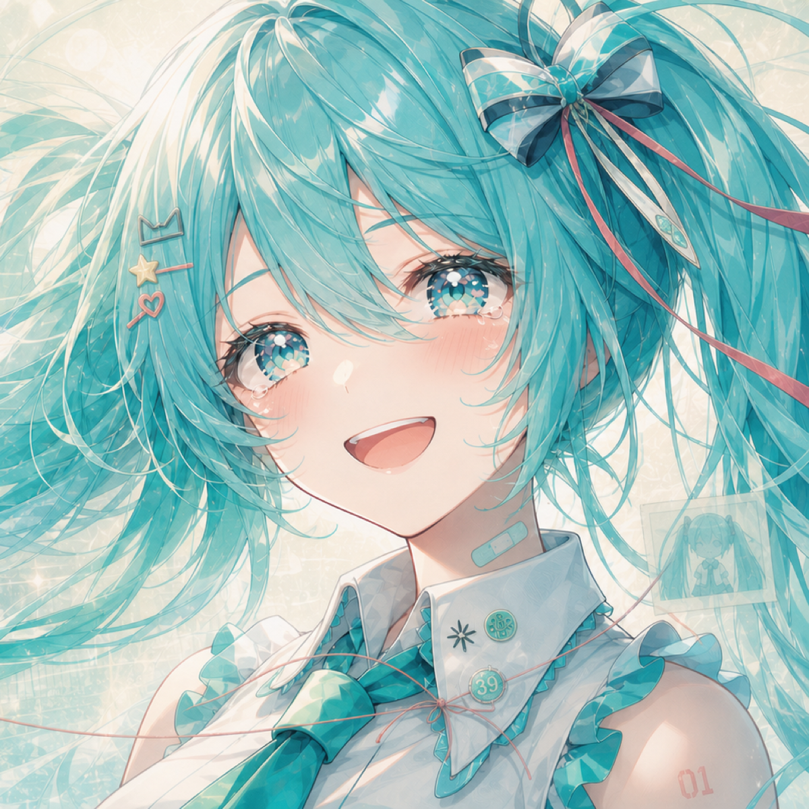
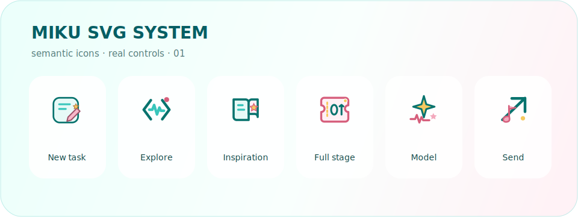

# MIKU Codex for macOS

<p align="center">
  <a href="./README.md">中文</a> · <strong>English</strong>
</p>

<p align="center">
  
</p>

<p align="center">
  <strong>A MIKU-inspired macOS skin for the real Codex workspace.</strong><br>
  Native DOM adaptation · loopback-only injection · persistent MIKU Codex launcher
</p>

> Unofficial and not affiliated with OpenAI or Crypton Future Media. This project does not modify the official `Codex.app`, `app.asar`, or code signature.

## Preview

<p align="center">
  
  <br>
  <sub>Real Codex injection. The repository owner confirmed that the visible screenshot content may be published.</sub>
</p>

The repository now includes an installable public MIKU preset. Both the main and side-chat backgrounds live under `macos/presets/preset-miku-love-words/`. The public side-chat composition is cropped from the same main background; it is not official *Love Words V* MV artwork.

## Bundled MIKU assets

<p align="center">
  <a href="macos/presets/preset-miku-love-words/background.png"></a>
  <a href="macos/presets/preset-miku-love-words/side-chat-background.png"></a>
</p>

<p align="center">
  <a href="docs/images/miku-svg-system.svg"></a>
  <br>
  <sub>These are semantic vectors, not screenshot slices. Runtime recipes select symbols for real Codex controls.</sub>
</p>

- [`macos/presets/preset-miku-love-words/background.png`](./macos/presets/preset-miku-love-words/background.png): main window background
- [`macos/presets/preset-miku-love-words/side-chat-background.png`](./macos/presets/preset-miku-love-words/side-chat-background.png): public side-chat background
- [`macos/assets/miku-love-words-icons.svg`](./macos/assets/miku-love-words-icons.svg): complete UI SVG sprite
- [`macos/assets/miku-codex-app-icon.svg`](./macos/assets/miku-codex-app-icon.svg): bright desktop app icon source
- [`macos/assets/fonts/miku-love-words-script.woff2`](./macos/assets/fonts/miku-love-words-script.woff2): bundled art-type subset embedded by the theme
- [`macos/assets/fonts/OFL.txt`](./macos/assets/fonts/OFL.txt): art-font license

## What it changes

- Keeps real Codex projects, tasks, threads, state, input controls, and interactions instead of replacing the app with a screenshot.
- Applies semantic SVG recipes to primary navigation, projects, the four home capabilities, environment panels, and composer controls. Projects do not need per-item bitmap assets.
- Adds an independent empty-state **灵感迸发** control to the main composer and each side-task composer. Suggestions still come from real tasks in the current project.
- Rotates 15 MIKU support phrases with restrained display type, kaomoji, and text symbols, then yields immediately when the user starts typing.
- Themes model speed and permission menus, including the visual **全开舞台** label, while preserving native permission values and accessibility semantics.
- Covers home, task, environment, and side-chat surfaces, with `prefers-reduced-motion` support.
- Installs a bright `MIKU Codex.app` launcher. Future launches restore the theme, while quitting Codex still leaves it stopped.

## Requirements

- macOS 13 or newer
- Official Codex Desktop installed and launched successfully at least once
- Quit Codex before installation so it cannot write its configuration concurrently
- No separate global Node.js install is required; the runtime validates and uses Codex's signed bundled Node

## Install with a Codex Agent

Send the block below to Codex on the destination Mac. The complete pitfalls, safety limits, failure signatures, and acceptance fields live in [`AGENTS.md`](./AGENTS.md) and [`macos/CLIENT_DEPLOY_PROMPT.md`](./macos/CLIENT_DEPLOY_PROMPT.md).

```text
Install MIKU Codex for macOS from the public main branch of https://github.com/hebi-Chinese/MIKU-Codex-macOS.git. First read AGENTS.md, README.md, and macos/README.md completely and follow the “MIKU Public Install Contract”. Do not copy only a wallpaper, CSS, or SVG; do not install the Fei-Away upstream; and do not accept the four legacy Dream Skin .command files as success. Preserve a dirty checkout, fast-forward a clean checkout, and prove local HEAD equals the remote main SHA. Reinstall the stable engine, select preset-miku-love-words, and byte-compare the installed renderer, adapter, CSS, SVG, bundled WOFF2 art font, side-chat image, and preset with the checkout before installing both MIKU Codex.app launchers. The official Love Words V MV illustration may only be the right-side chat / side-task background, never the main wallpaper or left project sidebar. Ask me for an absolute path to my local copy and import it with configure-miku-side-chat-macos.sh; never download or upload the image automatically. Without a local file, report the public fallback rather than claiming exact parity. I authorize one controlled Codex quit/relaunch for this install; launch through MIKU Codex.app. Run doctor --require-live and live verify. Completion requires version=1.3.7, mikuContractPass=true, contractVersion=miku-native-v2-2026-07-20.7, reconciliationContract=stream-safe-v2, artLayerPresent=true, artLayerPosition=fixed, 15 support phrases, 4 permission presentations, at least 56 SVG symbols, artTypographyPass=true, permissionArtTypographyPass=true, sideChatArtLoaded=true, and sideChatPanelCoveragePass=true. Treat ordinary fallback typography, “随心输入”, an unthemed native “完全访问”, missing “灵感迸发”, old home-card icons, a white side-chat panel, or theme flicker during GPT streaming as failure and continue repairing.
```

## Install

```bash
git clone https://github.com/hebi-Chinese/MIKU-Codex-macOS.git
cd MIKU-Codex-macOS/macos

# Install the stable engine without legacy Dream Skin desktop commands or auto-launch
./scripts/install-dream-skin-macos.sh --no-launchers --no-launch

STUDIO="$HOME/.codex/codex-dream-skin-studio"

# Install the only MIKU launch entry (Desktop + user Applications)
"$STUDIO/scripts/install-miku-launcher-macos.sh" \
  --target "$HOME/Applications/MIKU Codex.app"
"$STUDIO/scripts/install-miku-launcher-macos.sh" \
  --target "$HOME/Desktop/MIKU Codex.app"

# Select the complete MIKU preset bundled with this repository
"$STUDIO/scripts/switch-theme-macos.sh" \
  --id preset-miku-love-words --no-apply
```

For future launches, open `MIKU Codex.app` from the Desktop or user Applications folder. The launcher starts the installed official Codex app and restores theme injection on `127.0.0.1:9341`.

## Verify and restore

```bash
STUDIO="$HOME/.codex/codex-dream-skin-studio"

# Verify the current loopback session and theme markers
"$STUDIO/scripts/verify-dream-skin-macos.sh"

# Remove the theme configuration and relaunch stock Codex
"$STUDIO/scripts/restore-dream-skin-macos.sh" \
  --restore-base-theme --restart-codex
```

## Security boundary

- CDP binds to loopback only; do not run untrusted local software while the themed session is active.
- The injector accepts only a validated Codex process and expected `app://` renderer targets.
- The official app bundle, `app.asar`, Team ID, and code signature remain unchanged.
- The theme never rewrites API keys, base URLs, model providers, or task data.
- The bundled public preset is tracked; personal backgrounds, runtime state, logs, caches, theme archives, and build outputs remain ignored.

## Source map

- [`macos/assets/miku-a4-adapter.js`](./macos/assets/miku-a4-adapter.js): native DOM discovery, icon recipes, inspiration controls, and lifecycle
- [`macos/assets/miku-a4.css`](./macos/assets/miku-a4.css): MIKU visual layer, responsive rules, and reduced motion
- [`macos/assets/miku-love-words-icons.svg`](./macos/assets/miku-love-words-icons.svg): theme SVG sprite
- [`macos/assets/miku-codex-app-icon.svg`](./macos/assets/miku-codex-app-icon.svg): source for the MIKU Codex app icon
- [`macos/assets/fonts/miku-love-words-script.woff2`](./macos/assets/fonts/miku-love-words-script.woff2): bundled renderer art font
- [`macos/assets/fonts/OFL.txt`](./macos/assets/fonts/OFL.txt): SIL OFL 1.1 and upstream copyright notice
- [`macos/presets/preset-miku-love-words/`](./macos/presets/preset-miku-love-words/): seedable main background, side-chat background, and theme metadata
- [`docs/images/miku-svg-system.svg`](./docs/images/miku-svg-system.svg): visual overview of the SVG system
- [`macos/scripts/`](./macos/scripts/): install, start, verify, restore, and package scripts

This repository currently focuses on the macOS MIKU build. A known bundled Node/runtime-state restore blocker is still documented, so this README does not claim that the entire `npm test` suite passes.

## Upstream and license

This project builds on [Fei-Away/Codex-Dream-Skin](https://github.com/Fei-Away/Codex-Dream-Skin). Special thanks to **Fei-Away** and every contributor to the original project for establishing the external theming, macOS injection, and safe-restore foundations. This repository preserves the upstream MIT license and notices; see [`macos/LICENSE`](./macos/LICENSE) and [`macos/NOTICE.md`](./macos/NOTICE.md).

Hatsune Miku, Codex, and all related names, characters, trademarks, and assets belong to their respective rights holders. This is an unofficial, non-commercial fan project. The bundled MIKU backgrounds are excluded from the MIT software license; see [`macos/NOTICE.md`](./macos/NOTICE.md). Official *Love Words V* MV artwork is not committed to this repository.
